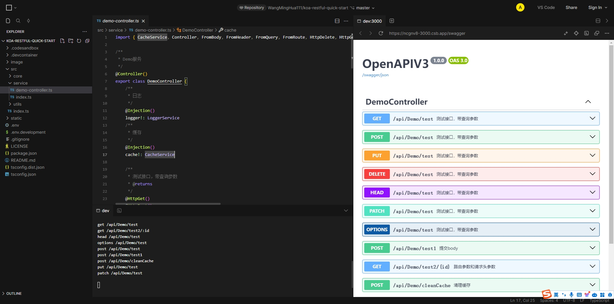
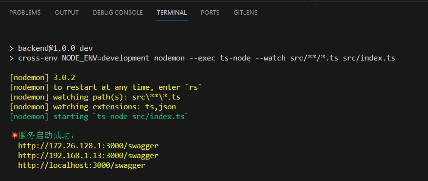
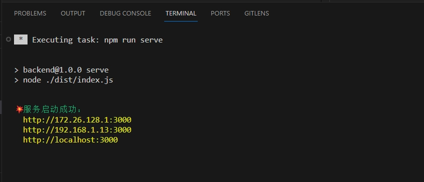
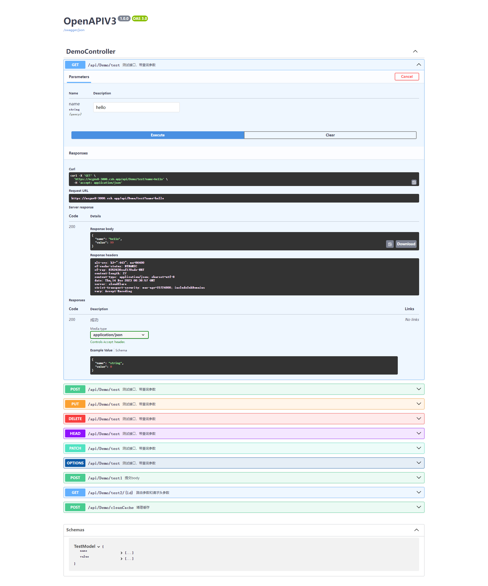

# koa-restful-quick-start

koa-restful 快速启动工程

<p align="center">
    <br />
    <br />
    <a href="https://codesandbox.io/p/github/WangMingHua111/koa-restful-quick-start/master">查看Demo/在线测试</a>
  </p>



## 快速开始

```sh
# 克隆项目
git clone https://github.com/WangMingHua111/koa-restful-quick-start.git
# 进行工作目录
cd koa-restful-quick-start
# 安装依赖
npm install
# dev模式启动
npm run dev
```

## 本地开发

```sh
npm run dev
```

## 构建生产环境

```sh
npm run build
```

## 运行服务

```sh
npm run serve
```

## Http Serve

```sh
http://localhost:3000
```

## 运行截图

### dev 模式



### 线上模式



### 自动生成 api swagger 文档



### Demo 控制器

```typescript
import { Authorize, CacheService, Controller, FromBody, FromHeader, FromQuery, FromRoute, HttpDelete, HttpGet, HttpHead, HttpOptions, HttpPatch, HttpPost, HttpPut, Injection, LoggerService } from '@wangminghua/koa-restful'
import { CookieAuthorization, JwtBearerAuthorization, SimpleAuthorize } from '@wangminghua/koa-restful/extra'
import { Context } from 'koa'

/**
 * Demo服务
 */
@Controller()
export class DemoController {
    /**
     * 日志
     */
    @Injection()
    logger: LoggerService
    /**
     * 缓存
     */
    @Injection()
    cache: CacheService

    @Injection()
    bearer: JwtBearerAuthorization

    @Injection()
    cookie?: CookieAuthorization

    /**
     * 执行登录
     * @param ctx
     * @returns
     */
    @HttpGet()
    login(ctx: Context) {
        const token = this.bearer.sign({
            data: new Date().toLocaleString(),
        })
        // 如果有 cookie 鉴权，写入cookie
        if (this.cookie) {
            const cookieToen = this.cookie.sign({
                data: new Date().toLocaleString(),
            })
            ctx.cookies.set(this.cookie.authorityHeader, cookieToen)
        }
        return token
    }

    /**
     * 测试Authorize
     * @returns
     */
    @Authorize()
    @HttpGet()
    auth() {
        return new Date().toLocaleString()
    }

    /**
     * 测试SimpleAuthorize
     * @returns
     */
    @SimpleAuthorize(['Bearer', 'Cookie'])
    @HttpGet()
    auth2() {
        return new Date().toLocaleString()
    }

    /**
     * 测试接口，带查询参数
     * @returns
     */
    @HttpGet()
    @HttpPost()
    @HttpPut()
    @HttpDelete()
    @HttpHead()
    @HttpPatch()
    @HttpOptions()
    async test(@FromQuery() name: string = 'hello'): Promise<TestModel> {
        const localeTime = await this.cache.get('localeTime', async () => {
            const locale = new Date().toLocaleString()
            return locale
        })

        this.logger?.info(`localeTime >>> ${localeTime}`)

        return {
            name: name,
            value: 99,
        }
    }
    /**
     * 提交body
     * @param body
     * @returns
     */
    @HttpPost()
    test1(@FromBody() body: TestModel) {
        return {
            ...body,
            name: 'hello ' + body.name,
        }
    }

    /**
     * 路由参数和请求头参数
     * @param body
     * @returns
     */
    @HttpGet('test2/:id')
    test2(@FromRoute() id: string, @FromHeader() name: string = 'hipy') {
        return {
            id,
            name,
        }
    }
    /**
     * 清理缓存
     * @param cacheKey 缓存Key
     */
    @HttpPost()
    cleanCache(@FromQuery() cacheKey = 'localeTime') {
        this.cache.delete(cacheKey)
    }
}

/**
 * 测试模型
 */
interface TestModel {
    /**
     * 名称
     */
    name: string
    /**
     * 数据值
     */
    value: number
}
```
